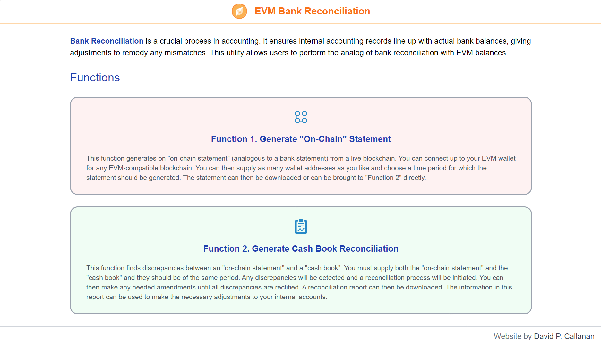
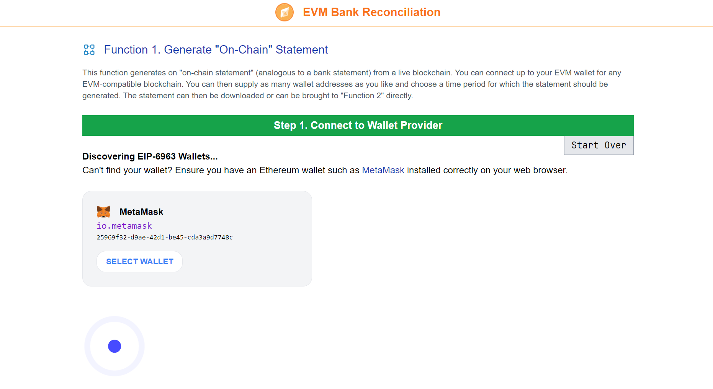
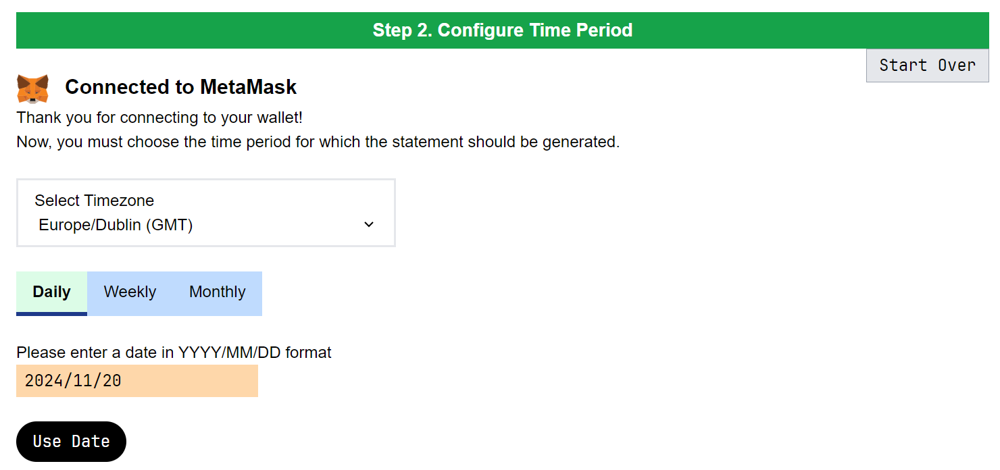
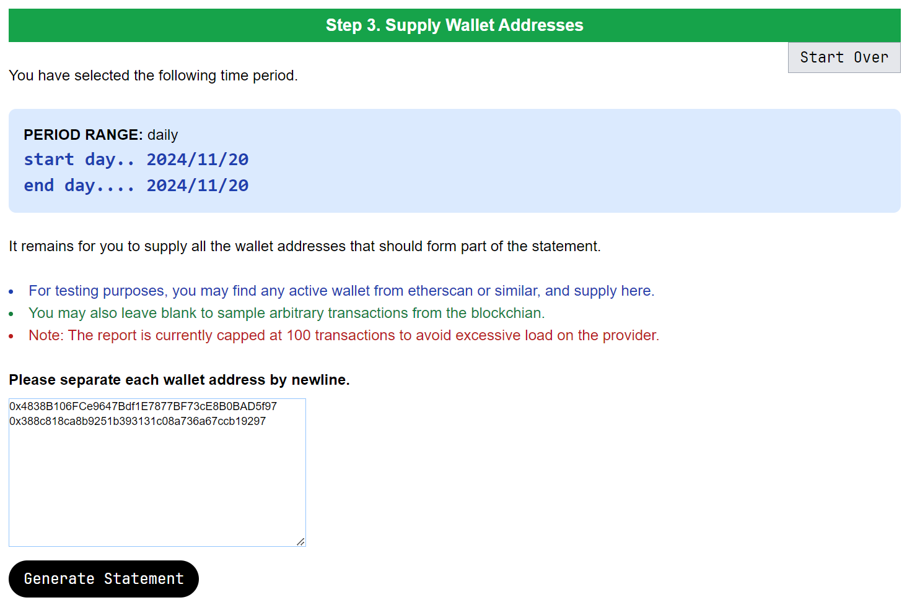
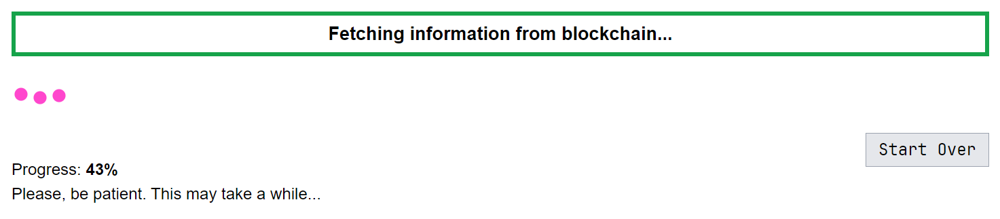
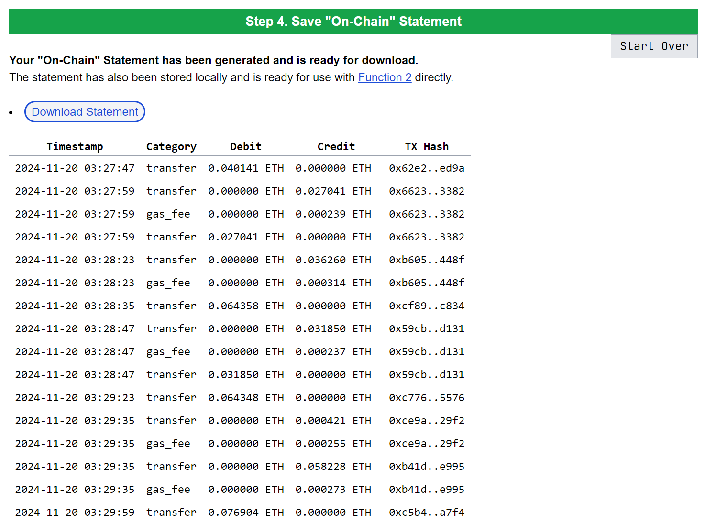
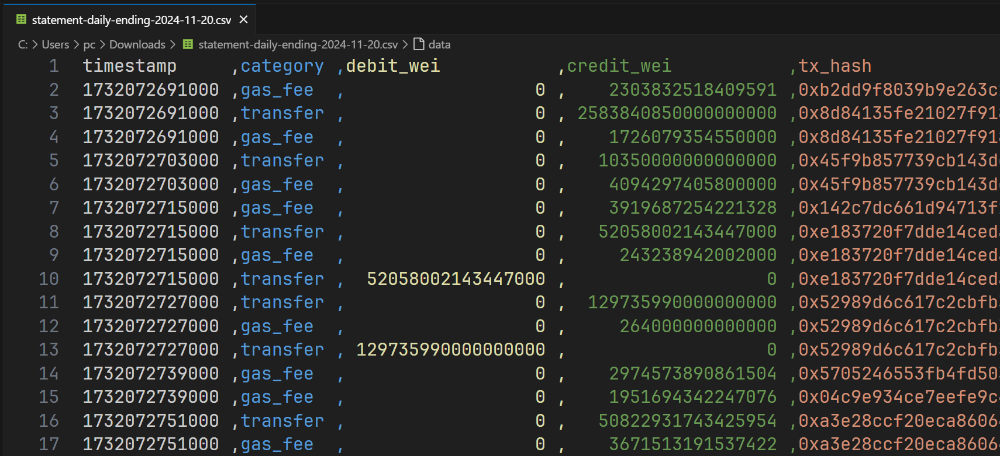

# EVM Bank Reconciliation

This is a proof-of-concept web application that allows users to perform the analog of bank reconciliation in Ethereum.

The project can be viewed live at [ebr-app.condensis.com](https://ebr-app.condensis.com).

## Features

 - Rather than "bank" reconciliation, we consider "on-chain" reconciliation.
 - The app connects up to the user's wallet provider and connects to any EVM-compatible blockchain.
 - The user can supply as many wallet addresses as they wish, and the app will handle them all simultaneously.
 - The app can then generate an "on-chain statement", which can optionally be downloaded for use at a later date.
 - The user can then upload a "cash book" CSV file, which would be produced by their internal accounting system. The app will then compare the "cash book" to the "on-chain statement", and attempt to reconcile the two.
 - Any discrepancies will be highlighted, and a reconciliation report will be generated.
 - The user can make amendments to the reconciliation process until the reconciliation is satisfactory.
 - The user can then download the report, and use the information in the report to make the necessary adjustments to their internal accounts.

## Tech Stack

 - **Language**: [JavaScript](https://developer.mozilla.org/en-US/docs/Web/JavaScript)/[TypeScript](https://www.typescriptlang.org/).
 - **Build Toolchain**: [Vite](https://vitejs.dev/).
 - **Frontend Framework**: [SolidJS](https://www.solidjs.com/).
 - **CSS Framework**: [TailwindCSS](https://tailwindcss.com/).
 - **Data Source**: [Ethereum Virtual Machine (EVM)](https://ethereum.org/en/developers/docs/evm/)
 - **Deployment**: [Firebase](https://firebase.google.com/).

## Development

### Prerequisites

 - [Node.js](https://nodejs.org/) `^20`.
 - [`pnpm`](https://pnpm.io/): `npm i -g pnpm@9`. 

### Setup

 - Install dependencies: `pnpm install`

### Start Dev Server

 - `pnpm run dev`

### Deploy

 - `npm i -g firebase-tools`
 - `firebase login`
 - `pnpm run deploy`

## Future Work

 - Support could be added for non-EVM blockchains.
 - One could support beyond just the native token of the blockchain, and consider ERC20 tokens or more complex transactions.
 - One could support simultaneous combination with other bank statements, and allow for an all-encompassing reconciliation process.

## Screenshots

### Home Page

### Function 1

**Step 1. Connect to Wallet Provider**

**Step 2. Configure Time Period**

**Step 3. Supply Wallet Addresses**

**Wait. Fetching information from blockchain**

**Step 4. Save "On-Chain" Statement**

**Downloaded CSV File**

### Function 2

This function is currently under development.
